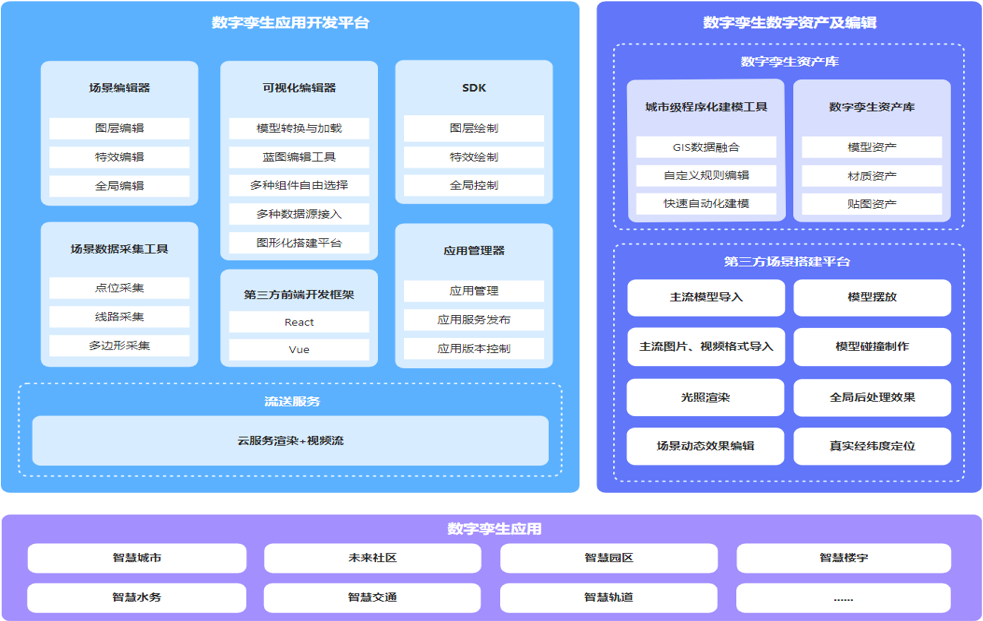

# 数字孪生低代码平台功能架构

## 一、数字孪生应用开发平台

### 1. 场景编辑器
- 图层编辑
- 特效编辑
- 全局编辑

### 2. 场景数据采集工具
- 点位采集
- 线路采集
- 多边形采集

### 3. 可视化编辑器
- 模型转换与加载
- 蓝图编辑工具
- 多种组件自选择
- 多种数据源接入
- 图形化搭建平台

### 4. 第三方前端开发框架
- React

### 5. SDK
- 图层控制
- 特效控制
- 全局控制

### 6. 应用管理器
- 应用管理
- 应用服务发布
- 应用版本控制

### 7. 流控服务
- 云服务渲染+视频流

## 二、数字孪生数字资产及编辑

### 1. 数字孪生资产库
- 城市级程序化建模工具
  - GIS数据融合
  - 自定义规则编辑
  - 快速自动化建模
- 数字孪生资产库
  - 模型资产
  - 材质资产
  - 贴图资产

### 2. 第三方场景搭建平台
- 主流模型导入
- 主流图片、视频综合导入
- 光照渲染
- 场景动态效果编辑
- 模型摆放、编辑
- 全局后处理效果

## 三、数字孪生应用场景

### 1. 智慧城市应用
- 智慧城市
- 智慧水务
- 未来社区
- 智慧交通
- 智慧园区
- 智慧轨道
- 智慧医疗
- 更多应用场景...

该平台提供了从场景编辑、数据采集、可视化构建到应用发布的全流程工具链，同时支持丰富的数字资产管理和场景搭建能力，最终服务于多个智慧城市领域的具体应用场景。
