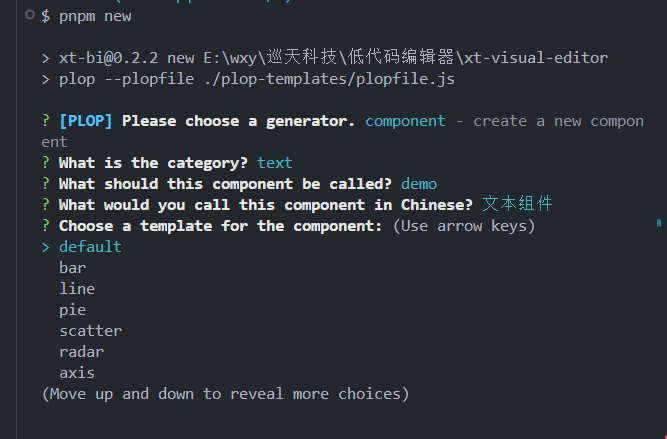
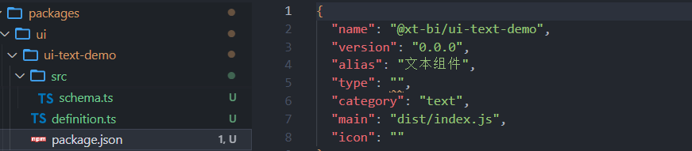
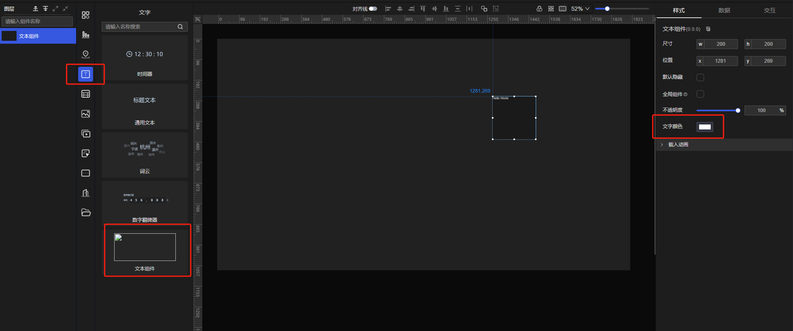
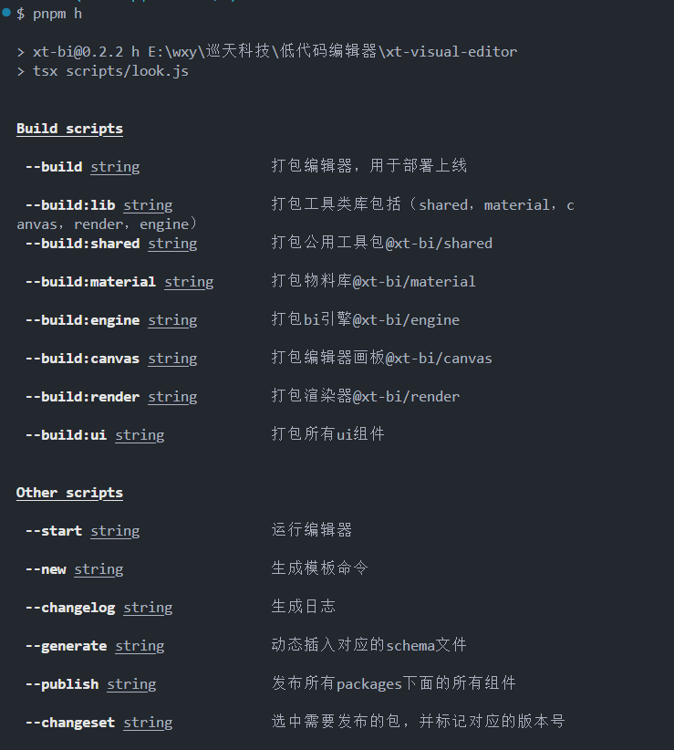

# 组件创建、构建和发布指南

## 组件的目录结构
每一个组件都是一个单独的npm包，其目录结构如下：
```ts
├── src
│   ├── index.tsx // 组件的入口文件
│   ├── schema.ts // 组件公用的方法，从@xt-bi/shared中引入
│   ├── index.moudle.less // 组件的样式文件
├── package.json // 组件的配置文件(json版本)
└── definition.ts // 组件的配置文件(ts版本)
├── CHANGELOG.md // 组件的更新日志
```
- src/index.tsx：组件的入口文件，定义了组件的主要功能和交互逻辑。
- src/schema.ts：组件的公用方法（比如从 @xt-bi/shared 引入的工具函数、通用逻辑）。
- src/index.module.less：组件的样式文件，采用 LESS 预处理器。
- package.json：该文件定义了组件的元数据，包括版本、类型、依赖等配置。
- definition.ts：该文件定义了组件的配置项，支持 TS 类型检查。
- CHANGELOG.md：记录每次组件发布的更新内容，帮助开发者跟踪变更。


## 组件的创建
以创建一个文本组件为例，组件的命令规则为 `ui-<category>-<name>`，其中：

- `category` 为组件的分类（如 `text`、`chart` 等）。
- `name` 为组件的名称。

1. **执行命令**
首先，在项目根目录下执行以下命令：

```bash
pnpm new
```

执行命令后，会出现如下提示：


2. **命令说明**

如上图所示，你需要输入组件的分类和名称。例如，输入：

- 组件类型：`text`
- 组件名称：`demo`
- 组件描述：文本组件
根据你选择的组件类型，系统将自动生成相应的默认代码。如果选择图表组件，还可以选择不同的图表类型。

3. **生成文件**

执行命令后，你会看到如下的文件结构，表示组件已成功创建：


4. **添加配置项**

[**表单域类型**](https://xtspace.yuque.com/otnc49/fp1zbw/tq98me50439mxs5u)

配置项的添加有两种方式，例如添加一个文字颜色的配置项

- **方式一：** 通过 definition.ts 配置

在 definition.ts 中链式定义配置项，可以享受 TypeScript 提示和更智能的配置方式。例如，添加一个文字颜色配置项：
```ts
import { cp, defineComponent } from "@xt-bi/shared/src/definition";

export default defineComponent()
  .config({
    myProperty: cp("color")
      .name("文字颜色")
      .default("#ffffff")
      .value(),
  });

```
执行 pnpm save:ui 命令后，组件的配置会自动保存到 package.json 和数据库中。

- **方式二：** 通过 package.json 配置

你也可以直接在 package.json 中手动添加配置项：
```json
{
  "name": "@xt-bi/ui-text-demo",
  "version": "0.0.0",
  "alias": "文本组件",
  "type": "text-demo", // 组件类型为@xt-bi/ui-后面的内容，是必填项
  "category": "text",
  "main": "dist/index.js",
  "icon": "",
  "config": {
    "view": {
      "height": "200",
      "width": "200"
    },
    "config": {
      "myProperty": {
        "type": "color",
        "name": "文字颜色",
        "default": "#ffffff"
      }
    }
  }
}

```

两种方式的优缺点如下

**方式一：** 优点是配置项的添加更加智能，有ts提示，缺点是结构不清晰，需要一定的上手成本

**方式二：** 优点是结构清晰，上手成本低，缺点是配置项没有智能提示

执行完以上操作，你会发现组件列表中的文本类型多了一个组件，如果报错，需执行`pnpm clear`,重新`pnpm i`



## 组件的构建
- 构建所有组件：执行以下命令会自动打包所有组件：
```bash
pnpm build:ui
```
- 构建单个组件：如果你只想打包某个组件，可以使用 -p 参数指定组件名称：
```bash
pnpm build:ui -p @xt-bi/ui-text-demo
```
其中 ui-text-demo 为组件文件夹的名称。


## 组件的发布
本项目使用 changeset 进行版本管理，发布组件时需要执行以下步骤：

1. 执行 Changeset 命令
在执行发布前，先使用 pnpm changeset 命令记录本次发布的变更内容：

```bash
pnpm changeset
```
该命令会提示你选择要发布的内容，选择完成后，它会自动生成一个统一的变更日志文件。

2. 执行版本打包命令
使用以下命令来生成对应的日志文件：

```bash
pnpm version-packages
```

3. 发布到 NPM
最后，执行 pnpm publish 命令将组件发布到 NPM：

```bash
pnpm publish
```

## 温馨提示
由于根目录的package.json中的scripts命令较多，可执行`pnpm h`命令查看

