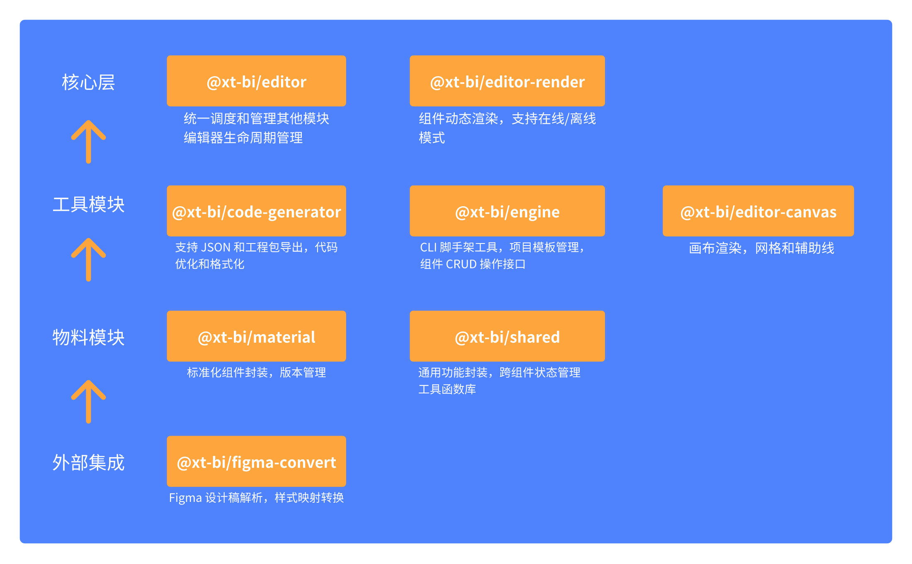

# 数字孪生低代码平台前端架构

## 核心思想
将复杂的业务功能拆分成多个独立的、可复用的模块，并通过多包管理的方式进行组织和管理，从而提高代码的可维护性、可测试性和可扩展性。

## 核心模块

### 🚀 @xt-bi/editor (编辑器核心)
- **核心功能**
  - 统一调度管理其他功能模块
  - 动态的表单域渲染
  - 提供完整的编辑器生命周期管理
  - 实现核心的编辑功能和交互逻辑
- **技术特点**
  - 采用发布订阅模式进行模块间通信
  - 统一的状态管理和数据流转

### 🎨 @xt-bi/editor-render (渲染容器)
- **核心功能**
  - 组件动态渲染引擎
  - 支持在线/离线渲染模式
  - 统一的渲染接口规范
- **技术特点**
  - 基于 Virtual DOM 的高效渲染
  - 支持组件懒加载和预加载
  - 提供渲染性能优化方案
  - 实现渲染错误边界处理

### 🛠️ @xt-bi/code-generator (出码模块)
- **核心功能**
  - 支持json和工程包导出两种方式
  - 代码优化和格式化
- **技术特点**
  - 基于 AST 的代码转换
  - 支持自定义代码模板
  - 内置代码质量检查

### 📝 @xt-bi/engine (引擎模块)
- **核心功能**
  - CLI 脚手架工具
  - 项目模板管理
  - 组件 CRUD 操作接口
- **技术特点**
  - 支持自定义项目模板
  - 提供完整的 API [文档](https://xtspace.yuque.com/otnc49/fp1zbw/upaarxkan6kdltg1)

### 🔮 @xt-bi/ui-xxx-xxx (物料组件库)
- **核心功能**
  - 标准化的组件封装
  - 组件版本管理
  - 按需加载支持
- **技术特点**
  - 统一的组件开发规范
  - TypeScript 类型支持

### 🎉 @xt-bi/shared (共享模块)
- **核心功能**
  - 通用功能封装
  - 跨组件状态管理
  - 工具函数库
- **技术特点**
  - 高复用性工具方法
  - 统一的错误处理机制

### 🎨 @xt-bi/editor-canvas (画布模块)
- **核心功能**
  - 画布渲染引擎
  - 网格和辅助线
- **技术特点**
  - Canvas 渲染支持
  - 高性能图形处理
  - 事件系统封装

### 🔮 @xt-bi/figma-convert (Figma导入模块)
- **核心功能**
  - Figma 设计稿解析（目前支持形状、文字、图片）
  - 样式映射转换
  

## 技术规范

### 开发规范
- 统一使用 TypeScript 进行开发
- 遵循 ESLint + Prettier 代码规范
- 使用 Conventional Commits 规范

### 版本管理
- 遵循 Semantic Versioning 规范
- 使用 Changelog 记录版本变更
- 采用 monorepo 管理多包项目
- 统一的发布流程规范

### 文档规范
- 统一的文档生成工具
- 详细的 API 文档
- 完整的使用示例
- 持续更新的开发指南
