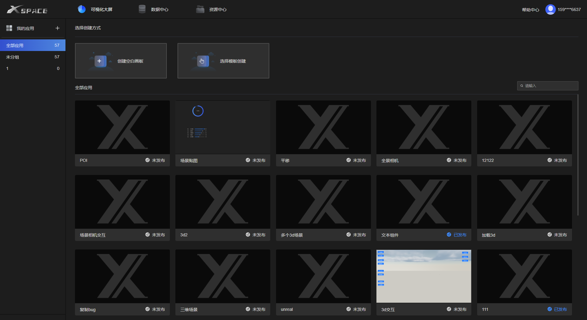
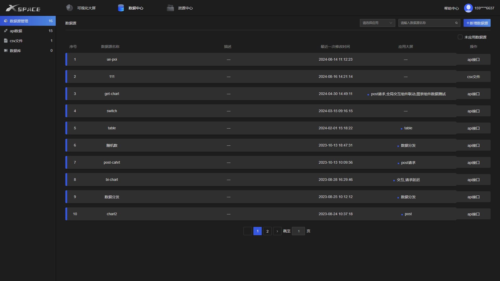
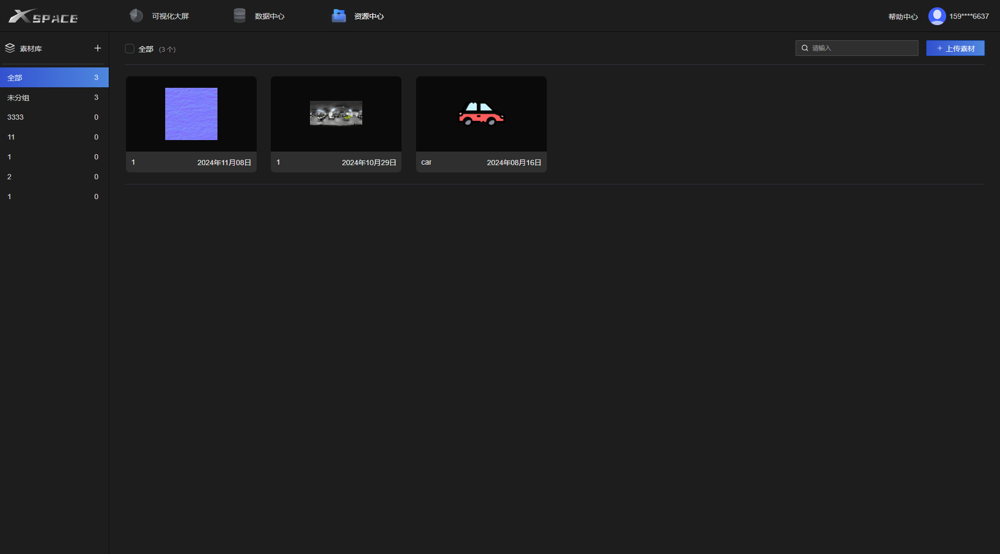
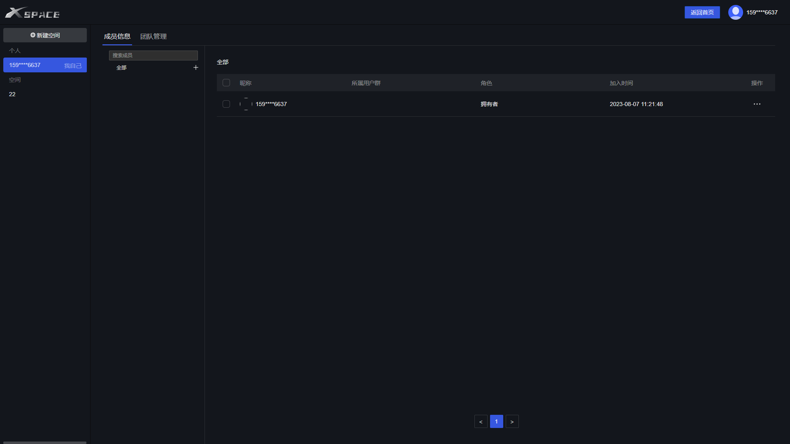
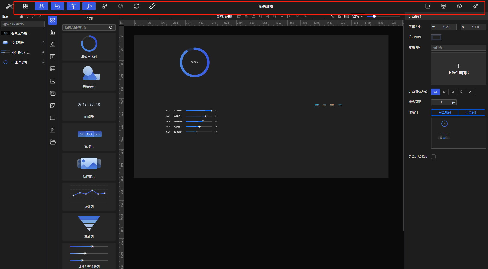
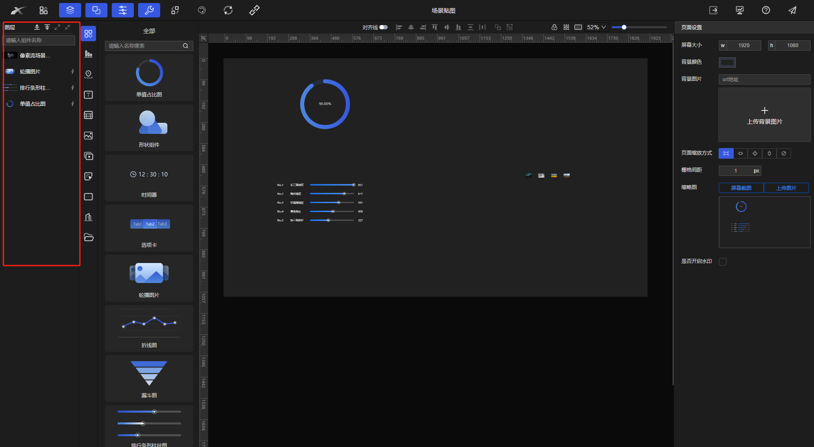
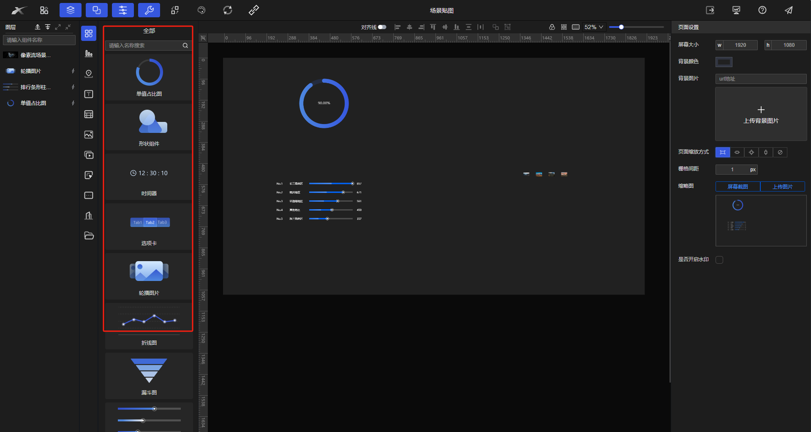
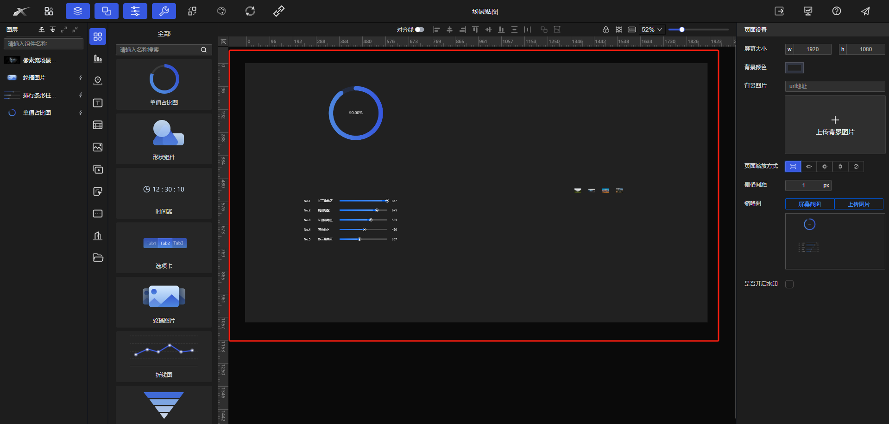
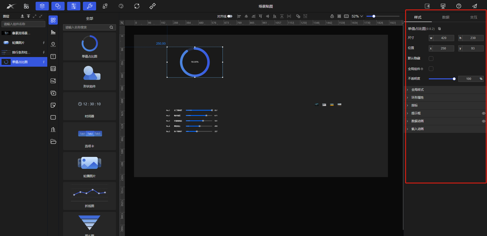

# 简介

快速实现“各行业数字孪生场景可视化”需求的低代码开发平台，拥有简单轻松的拖拽式编辑操作，灵活性极高的组件配置和丰富的模板、素材，同时提供高效的二次开发引擎，可满足复杂业务逻辑，一站式开发、部署和运维。

想尝试一下？[点这里](https://bi.xtspace.cn)。

## 管理平台概览

管理平台提供集中式管理项目、数据、资源和空间的功能模块，提升用户工作效率。
### 项目管理中心

* 创建、管理、查看和删除项目。
* 支持模版创建项目

### 数据管理中心

* 支持CSV、JSON、MySQL等多种数据格式导入，简化数据管理。

### 资源管理中心

* 管理系统资源（文件、图片、音视频等），确保资源高效利用和存储。
* 支持图片、音视频等资源的在线预览，无需下载即可查看内容
* 用户可以创建自定义分组，将资源按照项目、类型或其他自定义标准进行分类管理。 这有助于提高资源查找和管理效率，避免资源混乱

### 空间管理中心

* 通过图形化界面展示项目空间及其属性，方便管理和调整。

## 编辑器功能概览

编辑器是项目的核心开发工具，提供高效的开发和设计工具。

### 头部功能区

提供辅助开发功能：

1. **工程导出:**  导出项目为Web项目、静态文件、源代码等多种格式，支持自定义导出配置。
2. **Figma导入:**  导入Figma设计文件（目前支持文本、形状、图片）。
3. **主题设置:**  自定义编辑器主题。
4. **组件版本更新:**  更新已使用的组件版本。

### 图层列表

显示项目所有层级元素（文本、图片、组件等），支持拖拽操作。

1. **层级管理:** 拖拽调整元素显示层级。
2. **图层筛选与搜索:**  根据类型、名称、属性等筛选图层。
3. **隐藏与锁定图层:**  隐藏或锁定图层，避免干扰。

### 组件列表

展示系统所有可用组件，支持拖放操作。

1. **组件分类与搜索:**  按功能、类型分类，方便浏览和搜索。
2. **组件拖放:**  直接将组件拖放到画布区域。

### 画布区域

编辑器的核心区域，进行设计、编辑和排版操作。

1. **可视化编辑:**  直观的拖拽操作创建、调整和删除组件、元素和图层。
2. **实时预览:**  实时预览修改效果。
3. **支持缩放与滚动:**  支持缩放和滚动，适应不同分辨率和设计需求。

### 组件配置面板

配置选中组件的详细属性（样式、数据绑定、交互行为等）。

1. **样式配置:**  调整颜色、大小、字体、边距等样式属性。
2. **数据绑定:**  绑定到API数据、数据库等数据源。
3. **交互配置:**  配置点击、悬停、动画等交互行为，自定义事件和条件。
4. **实时同步:**  修改配置面板属性后，画布区域实时同步。

更详细的说明 [点这里](https://xtspace.yuque.com/fyho0s/manual)。

## 平台优势
- 易用性： 拖拽式操作，简单易学，无需专业编程技能。
- 灵活性： 丰富的组件配置，可满足各种场景需求。
- 可扩展性： 提供二次开发引擎，可满足复杂业务逻辑。
